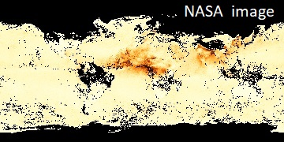
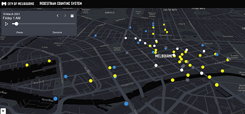
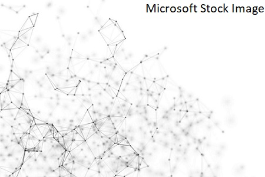

If you're interested in working with me on any of these research areas, get in touch. 

## Detecting interesting events from sensor data

Sensors, sensors, sensors! There is a massive amount of sensor data available to the general public from various organisations including NASA, ESA and local governments. Some data from NASA or ESA satellites are on the whole world. The  picture above shows the aerosol data from a NASA satellite for a specific month.    

Some data are more localised. The picture above shows the count sensor data from the pedestrian counting system in Melbourne at a certain time (http://www.pedestrian.melbourne.vic.gov.au/). Whichever type of sensor data you're looking at, you can detect interesting events from this data giving analysts, decision makers and the general public useful insights. Developing mathematical, statistical and machine learning models to detect these events in a robust manner is of interest to many stake holders. 

## Anomalies in Networks

Many application such as Cyber Security and Social Networks have dynamic network structures. Detecting anomalous events in these complex structures is crucial due to the high impact nature of these applications. For example, an anomalous event in an IoT network may signify an intrusion.  New methodology is needed to detect such events in these dynamic environments. 

## Methodology for anomaly detection
Often, we need to take a step back from the application and formulate the problem using mathematical and statistical concepts. Developing methodologies for anomaly detection in different mathematical settings gives more flexibility than concentrating on a specific application. Many times,  the application serves as a starting point to explore a bigger research problem.

## Information for prospective students 
If you're interested in working with me on a PhD or an MSc, you need to have a degree in Mathematics, Statistics, IT or Engineering. In addition, some programming skills are also needed. 

An interest to learn more mathematics and statistics is essential, because a PhD or an MSc is a journey into the unknown exploring new territories. 

I'm always happy to chat with prospective MSc and PhD students. 