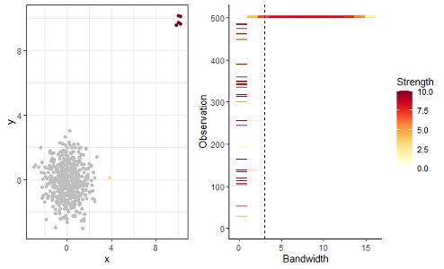
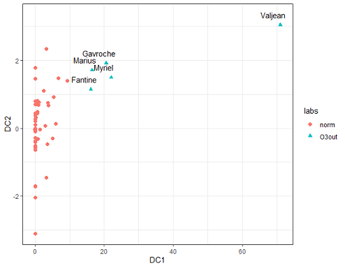
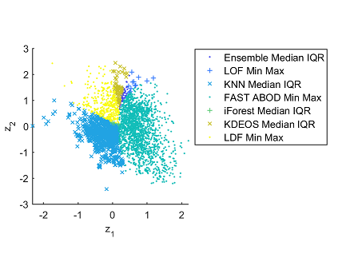

Detecting **unusual patterns in data** is really important because they tell a different story from the norm. These unusual data points or anomalies might signify intrusions, fraudulent credit card activities or an abnormal reaction to a vaccine. 

I have investigated the following research questions in anomaly detection.

1. High dimensional data \\
When data is high dimensional, anomaly detection becomes more complex. 

2. Choosing parameters for anomaly detection algorithms \\
Most anomaly detection algorithms include user-defined parameters. Selecting these parameters carefully is a really important, because for different parameters the algorithms detect different anomalies. So the obvious question, "which anomalies are real anomalies", arises. 

3. Anomaly persistence \\
Are there anomalies that get identified for a large range of parameter values? How can we visualize them?

4. Pre-processing techniques for anomaly detection \\
There are standard pre-processing techniques applied to a dataset before performing anomaly detection. What are the effects of these pre-processing techniques? If you use a different pre-processing technique, will the algorithms detect different anomalies? 

5. Which anomaly detection method is best suited for my problem? \\
This is known as the "algorithm selection problem". It is known that no single algorithm gives superior performance for all problems. This is known as the *No Free Lunch* theorem. So how would you select the best algorithm for your problem?

Below are some non-technical summaries of my research. 

   **Leave-one-out kernel density estimates for outlier detection** \\
Sevvandi Kandanaarachchi, Rob J Hyndman \\
preprint (2021)  \\

There are many density-based methods for anomaly detection. Kernel density estimates are used to compute the density of points in a data cloud. The kernel density estimation algorithms have a parameter called the bandwidth. Anomaly detection algorithms that use kernel density estimates ask the user to input the bandwidth parameter. We use a different branch of mathematics -- topological data analysis -- to compute the bandwidth for anomaly detection. We call this algorithm *lookout*.  We've made the R package *lookout* available and details can be found at https://sevvandi.github.io/lookout/index.html.

We also look at anomaly persistence. That is, when we change the bandwidth gradually, how will the anomalies change? We explore this using a persistence diagram, which is shown at the top. The anomalies identified by lookout are shown in dark red on the left. On the right, we see that the same anomalies persist for a large range of bandwidth values.

   **Dimension reduction for outlier detection using DOBIN**  \\
Sevvandi Kandanaarachchi, Rob J Hyndman \\
JCGS (2020)  \\

Detecting anomalies in high dimensions is a challenge. Often people use low dimensional representations of the data to detect anomalies. But, there is an issue. How would you know that an anomaly in the high dimensional space is still an anomaly in the low dimensional representation? This is what we address in this paper. We find a low dimensional representation of the data so that anomalies in the original space are still anomalies in the low dimensional space. We call this algorithm *dobin*. (The R package dobin is available at  https://sevvandi.github.io/lookout/index.html. )

The figure at the top shows the characters is *Les Miserables* transformed to a low dimensional space using dobin. We see that Valjean is  quite  anomalous compared to the other characters. 

  **On normalization and algorithm selection for unsupervised outlier detection**  \\
Sevvandi Kandanaarachchi, Mario A Munoz, Rob J Hyndman, Kate Smith-Miles \\
Data Mining and Knowledge Discovery (2020)\\

A standard pre-processing technique for anomaly detection is to normalize the dataset. We explore different normalization techniques and their effects on different anomaly detection methods. The most used normalization method is called Min-Max. We show that Min-Max is only suited for about 50% of the datasets in our repository. So, effectively we are showing that the normalization method should not be fixed, but should be chosen depending on the dataset. 

We also explore the algorithm selection problem for anomaly detection.  That is, we answer the question, which anomaly detection algorithm is best suited for my problem? We also construct an instance space of these test problems, which is shown in the figure above. In this figure each point denotes a dataset and the color represents the best anomaly detection algorithm suited for it.  

