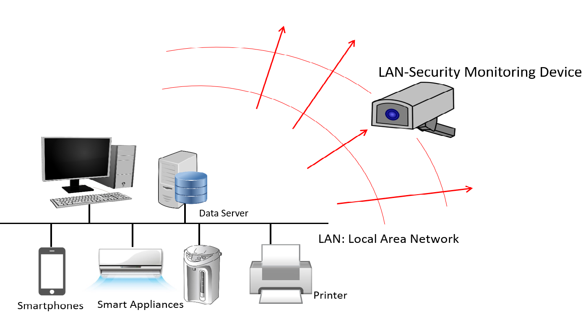

Cyber attacks are increasingly common in today's world. Generally speaking, attacks or intrusions can be identified by comparing with known attack signatures or by using anomaly detection. Using signature-based methods is really effective in identifying known attacks; but they cannot identify new attacks. Hence, the importance of anomaly detection. 

A honeypot aims to lure attackers in a computer network. You can read more about honeypots at https://us.norton.com/internetsecurity-iot-what-is-a-honeypot.html But honeypots are almost never standalone security measures. We look at ways of increasing honeypot performance. 

  **Honeyboost: Boosting honeypot performance with data fusion and anomaly detection** \\
Sevvandi Kandanaarachchi,  Hideya Ochiai, Asha Rao \\
preprint (2021) \\

How do you identify anomalous network traffic? Can you identify anomalous devices in a computer network? We explore these questions in this paper which is available at https://arxiv.org/abs/2105.02526. 
