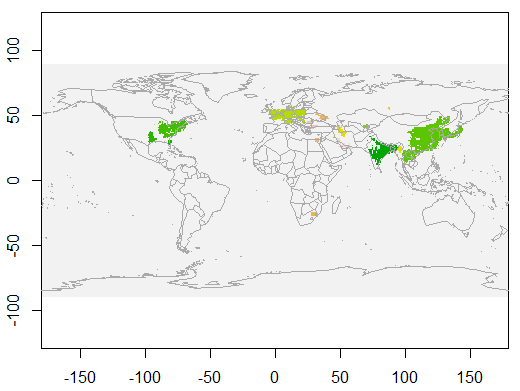
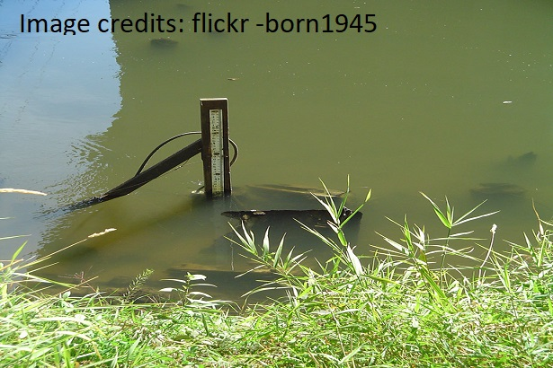
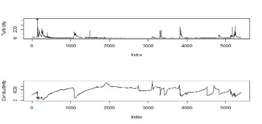

Sensor data can be of a spatio-temporal nature. Below are some non-technical summaries of my research. 

   **Early classification of spatio-temporal events using partial information** \\
Sevvandi Kandanaarachchi, Rob J Hyndman, Kate Smith-Miles \\
PLoS ONE (2020)  \\

How do we detect **events of interest** in spatio-temporal data? For example high density clusters of Nitrogen Dioxide may be of interest. Or high density clusters of aerosols may herald an impending bushfire. We present an event extraction method capable of extracting such events. We also discuss an algorithm for event classification using partial data. These algorithms are available in the R package *eventstream* and details can be found at https://sevvandi.github.io/eventstream/index.html

  **Early detection of vegetation ignition due to powerline faults** \\
Sevvandi. Kandanaarachchi, Nandini. Anantharama, Mario. A. Munoz \\
IEEE Transactions on Power Delivery (2020)  \\

On a scorchingly hot summer's day a branch falls on a powerline. This can spark a bushfire ravaging the countryside. We predict ignition from branches coming into contact with powerlines before the branch catches fire. Thus we detect it early, before the event.  Early detection can help prevent bushfires. This paper resulted from the initial work that we did with the Victorian Government as part of the Vegetation Detection Challenge (VDC). We were awarded the second prize at the VDC and it is featured at https://www.energy.vic.gov.au/safety-and-emergencies/powerline-bushfire-safety-program/research-and-development-grants/vegetation-detection-challenge

  **Predicting sediment and nutrient concentrations from high-frequency water-quality data** \\
Catherine Leigh, Sevvandi Kandanaarachchi, James M. McGree, Rob J. Hyndman, Omar Alsibai, Kerrie Mengersen, Erin E. Peterson \\
PLoS ONE (2019)  \\

Monitoring water in our rivers is important for many stake holders including the Government. We use water quality sensor data to predict turbidity, a measure of water clarity and the Nitrites present in water. This project was a collaboration with the Queensland Government. At the time of this project, the standard practice was to get water samples manually from the rivers and test it. So, a person had to go to the site, get a sample of water and then take it to the lab and test it. Our work showed that it can be automated by using in-situ sensors, that measure similar quantities, enabling more frequent predictions. This work was featured at https://www.arc.gov.au/news-publications/media/research-highlights/revolutionising-water-quality-monitoring-our-rivers-and-reef

  **A framework for automated anomaly detection in high frequency water-quality data from in situ sensors** \\
Catherine Leigh, Omar Alsibai, Rob J Hyndman, Sevvandi Kandanaarachchi, Olivia C King, James M McGree, Catherine Neelamraju, Jennifer Strauss, Priyanga Dilini Talagala, Ryan DR Turner and others \\
Science of The Total Environment (2019)  \\

Finding anomalies in water quality data using sensors was part of the same project we did with the Queensland Government. The anomalies from the sensors might be caused by many things including a dying battery or a sudden change upstream. Therefore, it is important to detect these anomalies quickly.